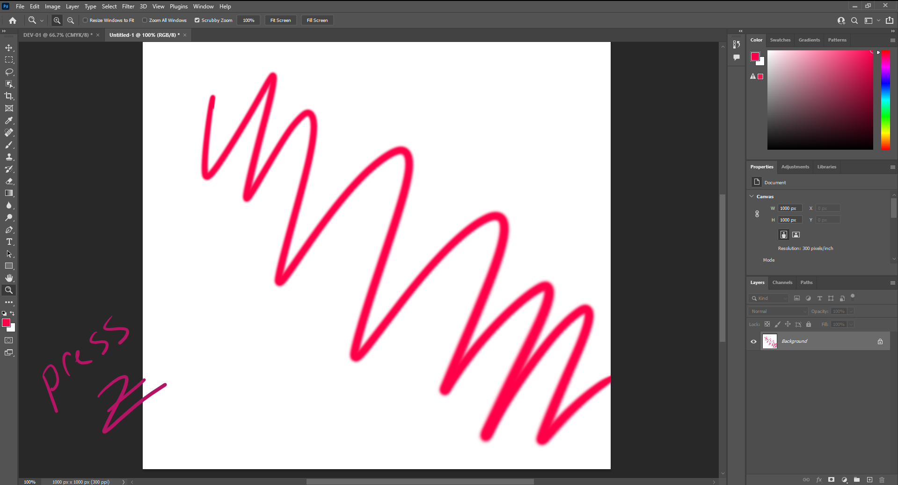
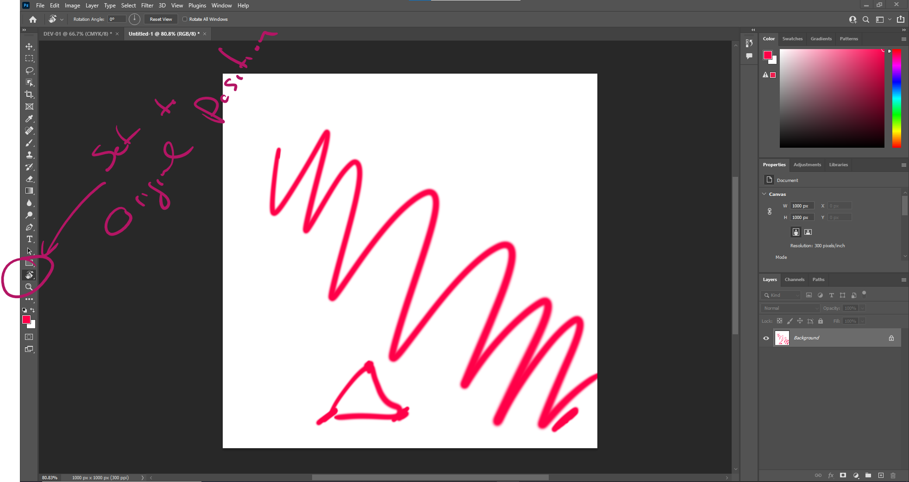
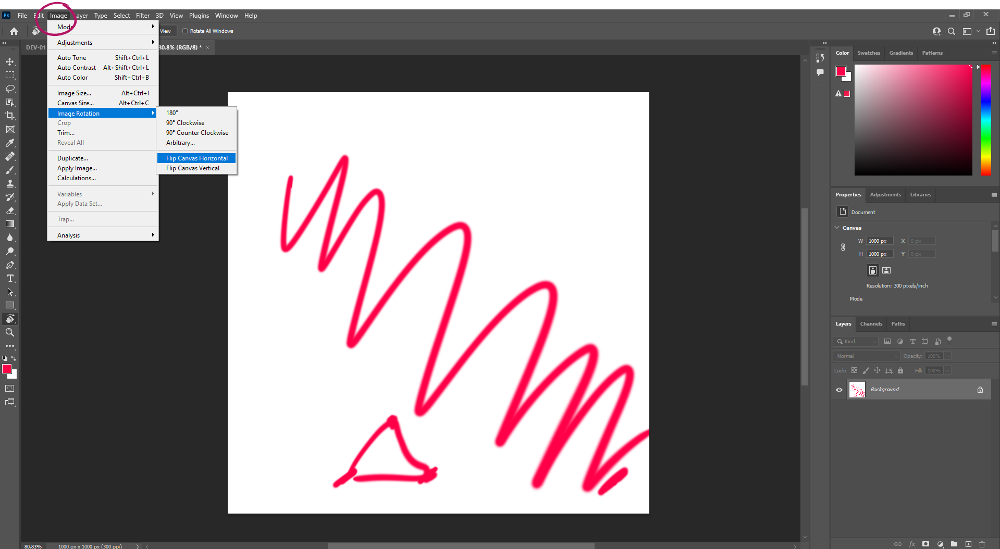

# DEV-02, Navigating
#### Tags: [navigation, zoom, move, rotate, flip]

## Zoom

    In order to Zoom, press Z key, then move the pen.
    You can hold ALT and use the mouse wheel to zoom.

## Translating

    In order to translate, press spacebar, then move the pen.

## Rotating

    In order to rotate, press R key, then manover with pen.

## Flip 

    This will flip the canvas