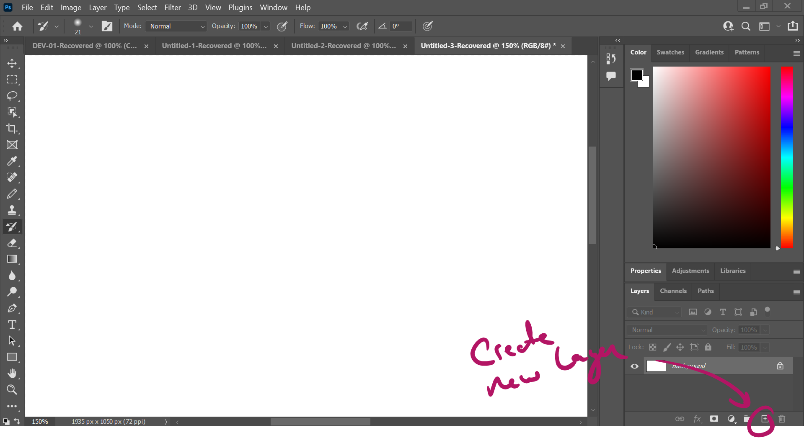
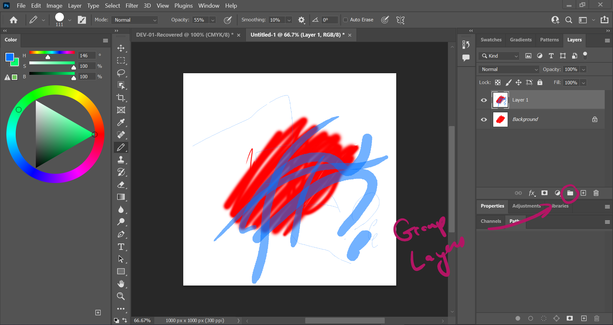
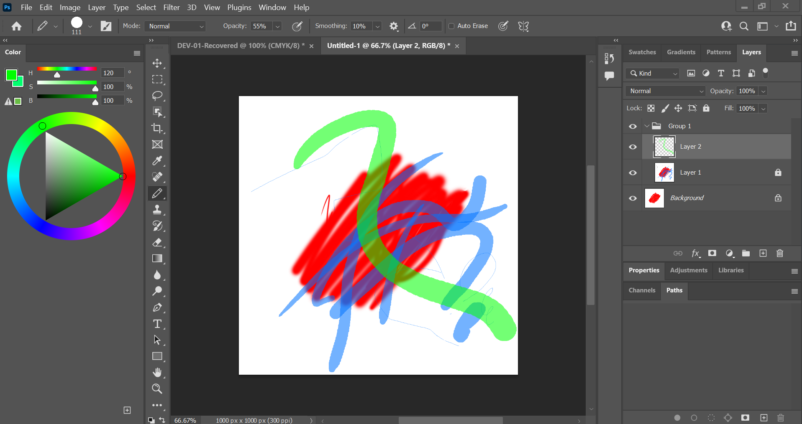
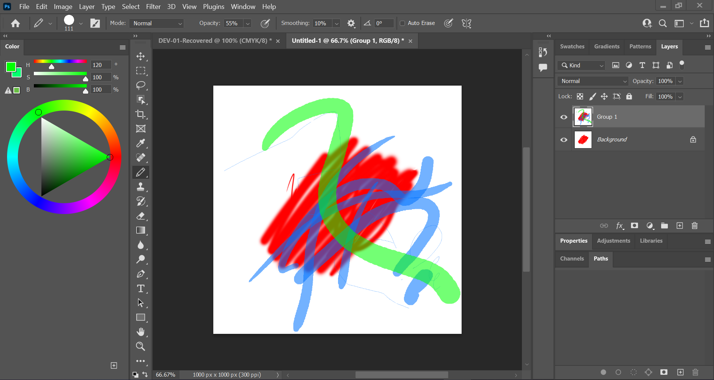

# DEV-05, Layers and Groups
#### Tags: [layers, groups]

## Creating a layer

    You can duplicate a layer with Ctrl + J
    You can create a brand new layer with Shift + Ctrl + N

    The Bottom button sometimes stops drawing of the pen, if you clicked it, you wont be able to see content drawin into you new layer
    Also check to see if the layer is locked.

## Group Folders

    You can create a heirarchy to put your layers in

    You can also merge all layers in a group together into one layer with Ctrl + E

