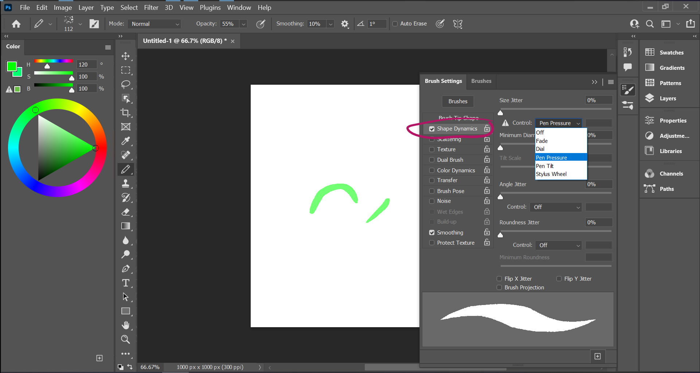

# DEV-06, Pencil Brush
#### Tags: [pencil]

## Brush Shape

    You can find the Brush settings here
    Enable shape Dynamics

    Having you setting for transfer will give you a painterly brush like this

    Any shape can really become a pencil brush with the correct settings